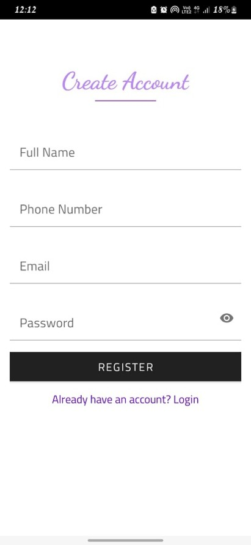
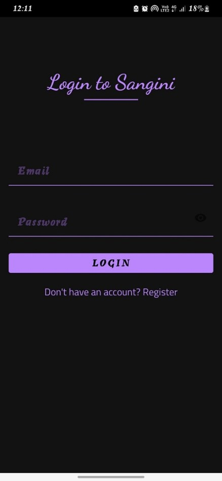
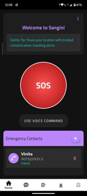
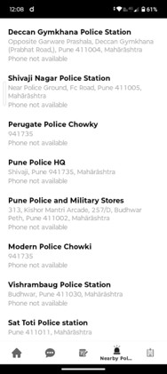
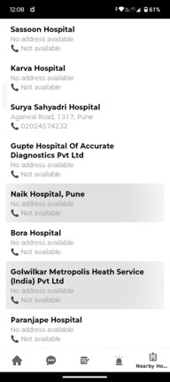
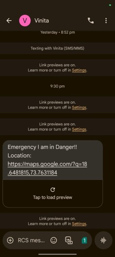

# Women_Safety


A Kotlin-based Android application designed to improve women’s safety through quick emergency assistance, location sharing, contact alerts, voice-triggered actions, and safety guidance.

## Overview

**Women_Safety** is a mobile safety application built to help users respond quickly in critical situations. It combines emergency communication, location-based assistance, nearby police search, chatbot support, and safety-oriented navigation in a clean and accessible Android experience.

## Key Features

- **SOS Emergency Alert** for instant distress signaling
- **Emergency SMS Support** to notify trusted contacts quickly
- **Location Access** to share or detect the current location
- **Nearby Police Station Lookup** based on user location
- **Voice Command Support** for hands-free emergency triggering
- **Chatbot / Safety Assistant** for guidance and basic support
- **Blogs Section** with safety tips and awareness articles
- **Login / Registration Flow** with Firebase Authentication
- **Bottom Navigation** for smooth and intuitive app navigation
- **Modern, responsive UI** built with Android best practices

## Tech Stack

- **Language:** Kotlin
- **UI:** Android XML layouts, Material Components
- **Navigation:** Android Navigation Component, Fragment-based architecture, Bottom Navigation View
- **Backend / Services:** Firebase Authentication, Firebase Firestore
- **Maps / Location:** Google Maps, Play Services Location
- **Communication:** SMS Manager, voice recognition
- **Libraries / Tools:** OkHttp, Lottie, AndroidX libraries

## App Highlights

### Emergency Support
- Send SOS alerts to saved emergency contacts
- Trigger emergency actions using voice input
- Request location permissions for accurate assistance

### Safety Assistance
- Find nearby police stations
- Read useful blogs and safety tips
- Use the chatbot for quick guidance

### Contact Management
- Add and delete emergency contacts
- Store user-specific data with Firebase
- Keep emergency information organized and accessible

## Screenshots

### Splash / Signup
| Splash Screen | Signup Screen |
| --- | --- |
|  |  |

### Home / SOS
| Login Screen | Home Screen |
| --- | --- |
|  |  |

### Nearby Police / Nearby Hospitals
| Nearby Police | Nearby Hospitals |
| --- | --- |
|  |  |

### Blogs / Chatbot / SMS
| Blogs | Chatbot |
| --- | --- |
|  |  |  |

## Project Structure

```bash
Women_Safety/
├── app/
│   ├── src/main/java/com/example/women_safety/
│   │   ├── ui/theme/
│   │   ├── adapters/
│   │   └── models/
│   ├── src/main/res/
│   │   ├── layout/
│   │   ├── navigation/
│   │   ├── drawable/
│   │   └── menu/
│   └── MainActivity.kt
├── build.gradle
├── settings.gradle
└── README.md
```

## Getting Started

### Prerequisites
- Android Studio
- Kotlin support
- Android device or emulator
- Firebase project setup
- Google Maps API key

### Installation

1. Clone the repository:
```bash
git clone https://github.com/VinitaPatil2005/Women_Safety.git
```

2. Open the project in **Android Studio**.

3. Sync Gradle and wait for dependencies to download.

4. Add Firebase configuration:
   - Place `google-services.json` inside the `app/` directory.

5. Add your Google Maps API key if required:
   - Update `res/values/google_maps_key.xml`

6. Run the app on an emulator or physical Android device.

## Build for Production

To generate a production build:

```bash
./gradlew assembleRelease
```

Or in Android Studio:
- Go to **Build > Build Bundle(s) / APK(s) > Build APK(s)**

## Permissions Used

The app may request the following permissions:

- `ACCESS_FINE_LOCATION`
- `ACCESS_COARSE_LOCATION`
- `ACCESS_BACKGROUND_LOCATION`
- `SEND_SMS`
- `RECORD_AUDIO`
- `POST_NOTIFICATIONS`
- `INTERNET`

## Author

**Vinita Patil**  
AIML Student | Android Developer | Front-End Developer

## License

This project is developed for educational and portfolio purposes.
